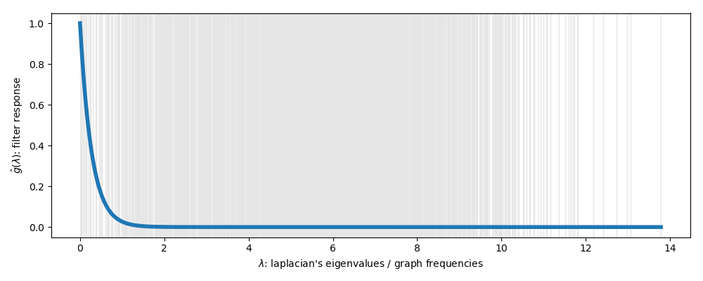
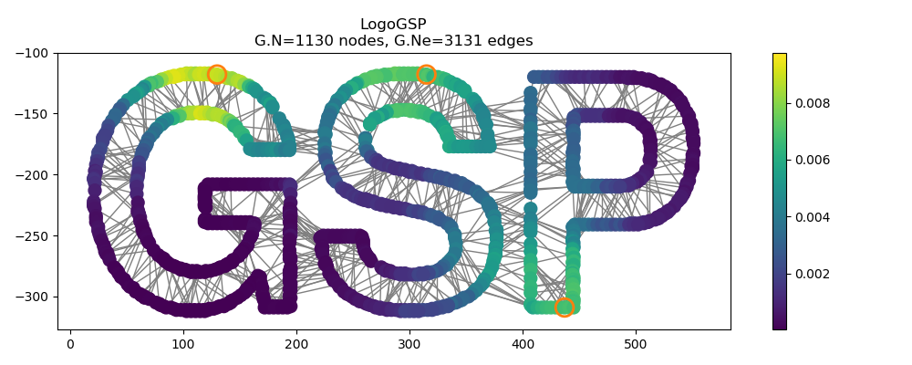

========================================
PyGSP: Graph Signal Processing in Python
========================================

The PyGSP is a Python package to ease
`Signal Processing on Graphs <https://arxiv.org/abs/1211.0053>`_.
The documentation is available on
`Read the Docs <https://pygsp.readthedocs.io>`_
and development takes place on
`GitHub <https://github.com/epfl-lts2/pygsp>`_.
A (mostly unmaintained) `Matlab version <https://lts2.epfl.ch/gsp>`_ exists.

+-----------------------------------+
| |doc|  |pypi|  |conda|  |binder|  |
+-----------------------------------+
| |zenodo|  |license|  |pyversions| |
+-----------------------------------+
| |travis|  |coveralls|  |github|   |
+-----------------------------------+

.. |doc| image:: https://readthedocs.org/projects/pygsp/badge/?version=latest
   :target: https://pygsp.readthedocs.io
.. |pypi| image:: https://img.shields.io/pypi/v/pygsp.svg
   :target: https://pypi.org/project/PyGSP
.. |zenodo| image:: https://zenodo.org/badge/DOI/10.5281/zenodo.1003157.svg
   :target: https://doi.org/10.5281/zenodo.1003157
.. |license| image:: https://img.shields.io/pypi/l/pygsp.svg
   :target: https://github.com/epfl-lts2/pygsp/blob/master/LICENSE.txt
.. |pyversions| image:: https://img.shields.io/pypi/pyversions/pygsp.svg
   :target: https://pypi.org/project/PyGSP
.. |travis| image:: https://img.shields.io/travis/epfl-lts2/pygsp.svg
   :target: https://travis-ci.org/epfl-lts2/pygsp
.. |coveralls| image:: https://img.shields.io/coveralls/epfl-lts2/pygsp.svg
   :target: https://coveralls.io/github/epfl-lts2/pygsp
.. |github| image:: https://img.shields.io/github/stars/epfl-lts2/pygsp.svg?style=social
   :target: https://github.com/epfl-lts2/pygsp
.. |binder| image:: https://mybinder.org/badge_logo.svg
   :target: https://mybinder.org/v2/gh/epfl-lts2/pygsp/master?filepath=playground.ipynb
.. |conda| image:: https://anaconda.org/conda-forge/pygsp/badges/installer/conda.svg
   :target: https://anaconda.org/conda-forge/pygsp

The PyGSP facilitates a wide variety of operations on graphs, like computing
their Fourier basis, filtering or interpolating signals, plotting graphs,
signals, and filters. Its core is spectral graph theory, and many of the
provided operations scale to very large graphs. The package includes a wide
range of graphs, from point clouds like the Stanford bunny and the Swiss roll;
to networks like the Minnesota road network; to models for generating random
graphs like stochastic block models, sensor networks, Erdős–Rényi model,
Barabási-Albert model; to simple graphs like the path, the ring, and the grid.
Many filter banks are also provided, e.g. various wavelets like the Mexican
hat, Meyer, Half Cosine; some low-pass filters like the heat kernel and the
exponential window; and Gabor filters. Despite all the pre-defined models, you
can easily use a custom graph by defining its adjacency matrix, and a custom
filter bank by defining a set of functions in the spectral domain.

While NetworkX_ and graph-tool_ are tools to analyze the topology of graphs,
the aim of the PyGSP is to analyze graph signals, also known as features or
properties (i.e., not the graph itself).
Those three tools are complementary and work well together with the provided
import / export facility.

.. _NetworkX: https://networkx.github.io
.. _graph-tool: https://graph-tool.skewed.de

The following demonstrates how to instantiate a graph and a filter, the two
main objects of the package.

>>> from pygsp import graphs, filters
>>> G = graphs.Logo()
>>> G.compute_fourier_basis()  # Fourier to plot the eigenvalues.
>>> # G.estimate_lmax() is otherwise sufficient.
>>> g = filters.Heat(G, scale=50)
>>> fig, ax = g.plot()

.. image:: ../pygsp/data/readme_example_filter.png
    :alt:

Let's now create a graph signal: a set of three Kronecker deltas for that
example. We can now look at one step of heat diffusion by filtering the deltas
with the above defined filter. Note how the diffusion follows the local
structure!

>>> import numpy as np
>>> DELTAS = [20, 30, 1090]
>>> s = np.zeros(G.N)
>>> s[DELTAS] = 1
>>> s = g.filter(s)
>>> fig, ax = G.plot(s, highlight=DELTAS)

.. image:: ../pygsp/data/readme_example_graph.png
    :alt:

You can
`try it online <https://mybinder.org/v2/gh/epfl-lts2/pygsp/master?filepath=playground.ipynb>`_,
look at the
`tutorials <https://pygsp.readthedocs.io/en/stable/tutorials/index.html>`_
to learn how to use it, or look at the
`reference guide <https://pygsp.readthedocs.io/en/stable/reference/index.html>`_
for an exhaustive documentation of the API. Enjoy!

Installation
------------

The PyGSP is available on PyPI::

    $ pip install pygsp

The PyGSP is available on `conda-forge <https://github.com/conda-forge/pygsp-feedstock>`_::

    $ conda install -c conda-forge pygsp

The PyGSP is available in the `Arch User Repository <https://aur.archlinux.org/packages/python-pygsp>`_::

   $ git clone https://aur.archlinux.org/python-pygsp.git
   $ cd python-pygsp
   $ makepkg -csi

Contributing
------------

See the guidelines for contributing in ``CONTRIBUTING.rst``.

Acknowledgments
---------------

The PyGSP was started in 2014 as an academic open-source project for
research purpose at the `EPFL LTS2 laboratory <https://lts2.epfl.ch>`_.
This project has been partly funded by the Swiss National Science Foundation
under grant 200021_154350 "Towards Signal Processing on Graphs".

The code in this repository is released under the terms of the `BSD 3-Clause license <LICENSE.txt>`_.

If you are using the library for your research, for the sake of
reproducibility, please cite the version you used as indexed by
`Zenodo <https://doi.org/10.5281/zenodo.1003157>`_.
Or cite the generic concept as::

    @misc{pygsp,
      title = {PyGSP: Graph Signal Processing in Python},
      author = {Defferrard, Micha\"el and Martin, Lionel and Pena, Rodrigo and Perraudin, Nathana\"el},
      doi = {10.5281/zenodo.1003157},
      url = {https://github.com/epfl-lts2/pygsp/},
    }
