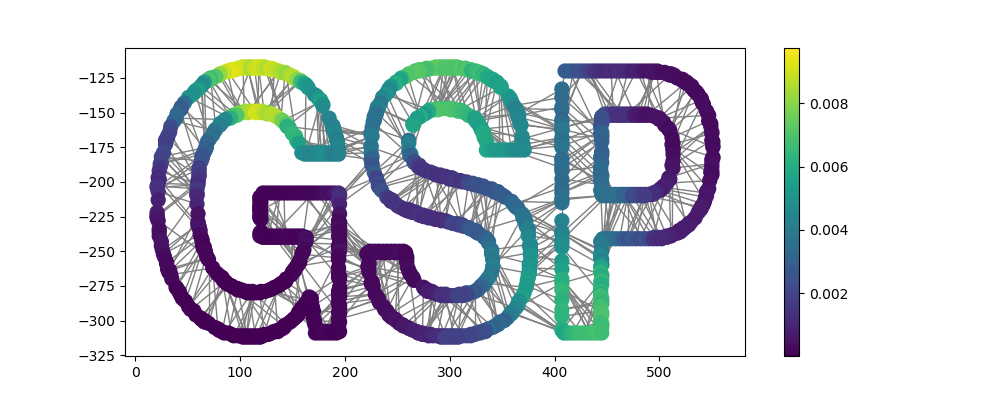

========================================
PyGSP: Graph Signal Processing in Python
========================================

.. image:: https://readthedocs.org/projects/pygsp/badge/?version=latest
   :target: https://pygsp.readthedocs.io/en/latest/

.. image:: https://img.shields.io/travis/epfl-lts2/pygsp.svg
   :target: https://travis-ci.org/epfl-lts2/pygsp

.. image:: https://img.shields.io/coveralls/epfl-lts2/pygsp.svg
   :target: https://coveralls.io/github/epfl-lts2/pygsp

.. image:: https://img.shields.io/pypi/v/pygsp.svg
   :target: https://pypi.python.org/pypi/PyGSP

.. image:: https://img.shields.io/pypi/l/pygsp.svg
   :target: https://pypi.python.org/pypi/PyGSP

.. image:: https://img.shields.io/pypi/pyversions/pygsp.svg
   :target: https://pypi.python.org/pypi/PyGSP

.. image:: https://img.shields.io/github/stars/epfl-lts2/pygsp.svg?style=social
   :target: https://github.com/epfl-lts2/pygsp

The PyGSP is a Python package to ease `Signal Processing on Graphs
<https://arxiv.org/abs/1211.0053>`_
(a `Matlab counterpart <https://lts2.epfl.ch/gsp>`_
exists). It is a free software, distributed under the BSD license, and
available on `PyPI <https://pypi.python.org/pypi/PyGSP>`_. The
documentation is available on `Read the Docs
<https://pygsp.readthedocs.io>`_ and development takes place on `GitHub
<https://github.com/epfl-lts2/pygsp>`_.

The PyGSP facilitates a wide variety of operations on graphs, like computing
their Fourier basis, filtering or interpolating signals, plotting graphs,
signals, and filters. Its core is spectral graph theory, and many of the
provided operations scale to very large graphs. The package includes a wide
range of graphs, from point clouds like the Stanford bunny and the Swiss roll;
to networks like the Minnesota road network; to models for generating random
graphs like stochastic block models, sensor networks, Erdős–Rényi model,
Barabási-Albert model; to simple graphs like the path, the ring, and the grid.
Many filter banks are also provided, e.g. various wavelets like the Mexican
hat, Meyer, Half Cosine; some low-pass filters like the heat kernel and the
exponential window; and Gabor filters. Despite all the pre-defined models, you
can easily use a custom graph by defining its adjacency matrix, and a custom
filter bank by defining a set of functions in the spectral domain.

The following demonstrates how to instantiate a graph and a filter, the two
main objects of the package.

>>> from pygsp import graphs, filters
>>> G = graphs.Logo()
>>> G.estimate_lmax()
>>> g = filters.Heat(G, tau=100)

Let's now create a graph signal: a set of three Kronecker deltas for that
example. We can now look at one step of heat diffusion by filtering the deltas
with the above defined filter. Note how the diffusion follows the local
structure!

>>> import numpy as np
>>> s = np.zeros(G.N)
>>> s[[20, 30, 1090]] = 1
>>> s = g.filter(s)
>>> G.plot_signal(s, backend='matplotlib')

.. image:: ../pygsp/data/readme_example.png
    :alt:

Please see the tutorials for more usage examples and the reference guide for an
exhaustive documentation of the API. Enjoy the package!

Installation
------------

The PyGSP is available on PyPI::

    $ pip install pygsp

Note that you will need a recent version of ``pip`` and ``setuptools``. Please
run ``pip install --upgrade pip setuptools`` if you get any installation error.

Contributing
------------

See the guidelines for contributing in ``CONTRIBUTING.rst``.

Acknowledgments
---------------

The PyGSP was started in 2014 as an academic open-source project for
research purpose at the `EPFL LTS2 laboratory <https://lts2.epfl.ch>`_.
This project has been partly funded by the Swiss National Science Foundation
under grant 200021_154350 "Towards Signal Processing on Graphs".
